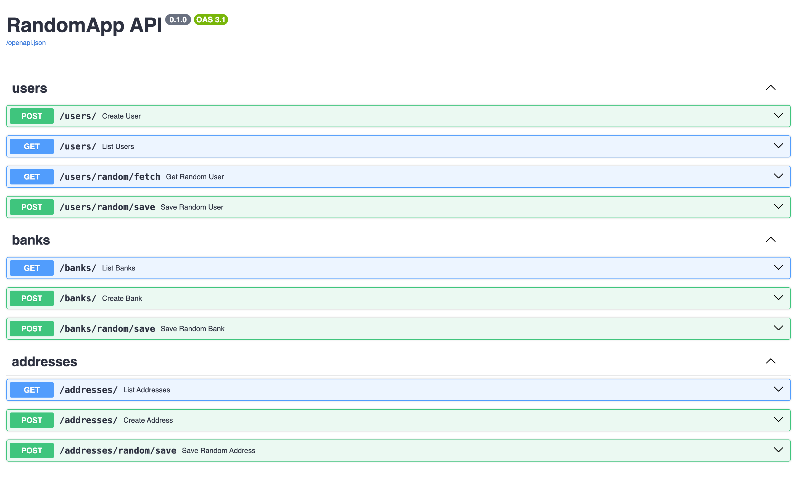

RandomApp API

A modular FastAPI project that generates and stores random Users, Banks, and Addresses, showing clean architecture, ORM relationships, and scalable structure.

Features

Three related entities

User → Bank → Address

Random data sources

Users: fetched from randomuser.me

Banks & Addresses: generated with Faker

Layered architecture

API → Service → Repository → Model → Schema

SQLite database (easily switchable to Postgres)

Fully typed with Pydantic v2 and SQLAlchemy 2.0

Project Structure
app/
├── api/ # FastAPI routers
│ ├── users.py
│ ├── banks.py
│ └── addresses.py
├── services/ # Business logic
│ ├── user_service.py
│ ├── bank_service.py
│ └── address_service.py
├── repos/ # Database access
│ ├── user_repo.py
│ ├── bank_repo.py
│ └── address_repo.py
├── models/ # SQLAlchemy models
│ ├── user.py
│ ├── bank.py
│ └── address.py
├── schemas/ # Pydantic DTOs
│ ├── user.py
│ ├── bank.py
│ └── address.py
├── adapters/ # External data generators
│ └── random_data.py
├── core/
│ ├── db.py # DB setup
│ └── settings.py # Config
└── main.py # App entrypoint

Setup & Run
1️⃣ Create virtual environment
python3.12 -m venv .venv
source .venv/bin/activate

2️⃣ Install dependencies
pip install -r requirements.txt

3️⃣ Run server
uvicorn app.main:app --reload

Server will start at → http://127.0.0.1:8000

Interactive docs → http://127.0.0.1:8000/docs

Endpoints Overview
👤 Users
Method Endpoint Description
GET /users/ List all users
POST /users/ Create user manually
GET /users/random/fetch Fetch random user (no save)
POST /users/random/save Fetch and save random user
🏦 Banks
Method Endpoint Description
GET /banks/ List all banks
POST /banks/ Create bank manually
POST /banks/random/save?user_id=1 Create random bank linked to user
📍 Addresses
Method Endpoint Description
GET /addresses/ List all addresses
POST /addresses/ Create address manually
POST /addresses/random/save?bank_id=1 Create random address linked to bank

Tech Stack

Python 3.12

FastAPI

SQLAlchemy 2.0

Pydantic v2

httpx

Faker

SQLite
